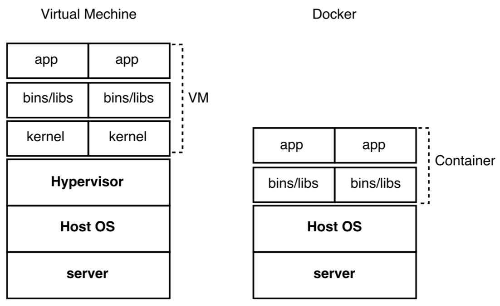

# Spring Boot + Docker #

##### Roadmap #####

* Overview Docker
* Integrasi Spring Boot dengan Docker
* Tools

## Docker ##

Docker pertama kali dikembangkan oleh **Solomon Hykes** sebagai project internal di dotCloud bersama dengan beberapa koleganya seperti **Andrea Luzzardi** dan **Francois-Xavier Bourlet**. 

> Docker adalah salah satu platform yang dibangun berdasarkan teknologi *container*. Docker merupakan teknologi berbasis *open-source* yang menyediakan platform terbuka untuk developer maupun sysadmin untuk dapat membangun, mengemas dan menjalankan aplikasi dimanapun sebagai sebuah wadah (container) yang ringan.

Docker berfungsi sebagai virtualisasi sebuah sistem operasi atau sebuah server atau sebuah web server atau bahkan sebuah database server, dimana dengan menggunakan virtualisasi ini, diharapkan developer dapat mengembangkan aplikasi sesuai dengan spesifikasi server atau dengan kata lain, jika kita mengembangkan sebuah aplikasi lalu kita jalankan pada komputer kita sendiri maka secara otomatis aplikasi akan berjalan dengan baik, nah bagaimana jika server yang akan menjalankan aplikasi kita memiliki banyak perbedaan dengan komputer kita seperti perbedaan sistem operasi, arsitektur processor dan sebagainya.


#### Virtual Mechine VS Docker ####

Dalam membangun program, pengembang biasanya menjalankan virtualisasi pada server sehingga proses pembuatan program dapat berjalan pada berbagai platform maupun konfigurasi hardware. Masalah yang dihadapi dengan virtualisasi adalah perlunya menyiapkan satu sistem operasi secara utuh, termasuk berbagai aplikasi yang dibawa sistem tersebut. Bisa dibayangkan dengan banyaknya virtualisasi yang berjalan di sebuah server akan memberatkan sistem tersebut.




Container kemudian datang dan membawa beberapa perubahan. Dengan container, sebuah program ‘diikat’ beserta library-nya, file konfigurasi, dan seluruh hal yang dibutuhkannya. Perbedaan yang sangat terlihat dibandingkan dengan virtualisasi adalah container memiliki ukuran file yang jauh lebih kecil karena tidak perlu menyiapkan sistem operasi secara penuh. Dalam hal ini, pengembang biasa menyebutnya sebagai *lightweight* platform. Aplikasi yang berjalan menggunakan container pun jauh lebih cepat dan lebih efisien.

Berbeda dengan virtualisasi yang mana aplikasi berjalan di atas hypervisor dan guest OS, docker dapat menjalankan aplikasi langsung tanpa kedua hal tadi. Docker juga dilengkapi dengan fitur sandbox yang menjamin pengerjaan pengembang dan sysadmin tidak terganggu. Sandbox pada istilah keamanan komputer adalah mekanisme pemisahan aplikasi atau program tanpa mengganggu host (isolasi).


#### Arsitektur Docker ####

Docker terdiri dari beberapa element diantaranya Docker Images dan Docker Container.

![docker-view] (img/docker-view.jpg)


##### Docker Image #####

Docker image adalah sebuah template yang bersifat read only. Template ini sebenarnya adalah sebuah OS atau OS yang telah diinstall berbagai aplikasi. Docker image berfungsi untuk membuat docker container, dengan hanya 1 docker image kita dapat membuat banyak docker container.


##### Docker Container #####

Docker container bisa dikatakan sebagai sebuah folder, dimana docker container ini dibuat dengan menggunakan docker image. Setiap docker container disimpan maka akan terbentuk layer baru tepat diatas docker image atau base image diatasnya. Satu atau lebih docker container dapat dibuat dari 1 docker image dengan menggunakan perintah `docker run`. Docker container ini nantinya dapat dibuild sehingga akan menghasilkan sebuah docker image, dan docker image yang dihasilkan dari docker container ini dapat kita gunakan kembali untuk membuat docker container yang baru.


#### Instalasi Docker ####

Proses installasi docker dapat dengan mudah dilakukan baik pada platform Windows, Linux maupun Mac-os. Tahapan installasi docker dapat diliat pada tautan berikut:

- Installasi Docker pada Mac 
    (https://docs.docker.com/docker-for-mac/)
    
- Installasi Docker pada Windows
    (https://docs.docker.com/docker-for-windows/)


## Spring Boot To Docker ##

Berikut adalah bagaimana membuat sebuah project sederhana berbasis spring boot dan build sebagai sebuah image ke dalam docker.

#### Aplikasi Spring Boot ####

Pertama kita akan membuat aplikasi spring boot melalui spring initializr:

1. Browse ke [https://start.spring.io/] (https://start.spring.io/)

2. Lengkapi Project Metadata

    Group
    
    ```java
    com.sheringsession.balicamp.springdocker    
    ```

    Artifact
    
    ```
    spring-demo1
    ```
   
    Dependencies
    
    ```java
    Web
    ```
   
3. Generate Project

4. Download dan import pada IDE masing-masing

5. Tambahkan pada class com.sheringsession.balicamp.springdocker.springdemo1.SpringDemo1Application seperti potongan code berikut:

    ```java
    @SpringBootApplication
    @RestController
    public class SpringDemo1Application {

        @RequestMapping("/spring/demo1/")
        public String hello(){
            return "Hello Docker World from Spring-Demo-1"
        }

        public static void main(String[] args) {
            SpringApplication.run(SpringDemo1Application.class, args);
        }
    }
    ```
    
6. Build dan Run via Maven 

    ```java
    mvn spring-boot:run
    ```
    
7. Coba akses via browser local ke halaman : http://localhost:8080/spring/demo1/

Setelah aplikasi sederhana berjalan dan memberikan response di local, selanjutnya bagaimana melakukan build aplikasi spring boot menjadi image pada docker.


#### Dockerfiles ####

![dockerfile] (img/dockerfile.jpg)

#### Docker Compose ####

Learn how to use Docker Compose to run multi-container applications easily


## Tools untuk Mengelola Docker ##

- Kitematic (https://kitematic.com)
- Portainer (https://portainer.io)


## Referensi ##

* [docker.com] (https://www.docker.com)
* [Learn Docker in 12 Minutes] (https://youtu.be/YFl2mCHdv24)
* [Spring Boot with Docker] (https://spring.io/guides/gs/spring-boot-docker/)
* [Portainer.io] (https://portainer.io/)
* [Kitematic] (https://kitematic.com/)